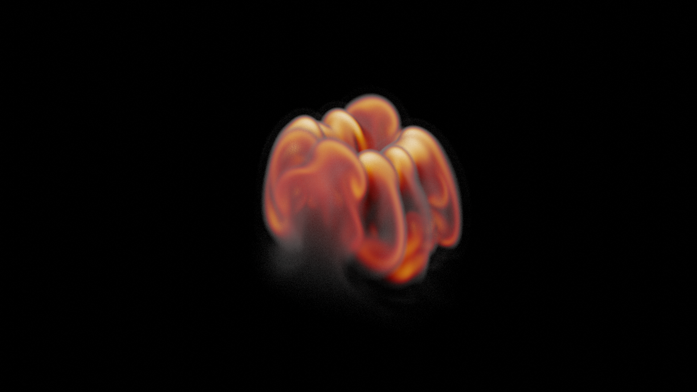
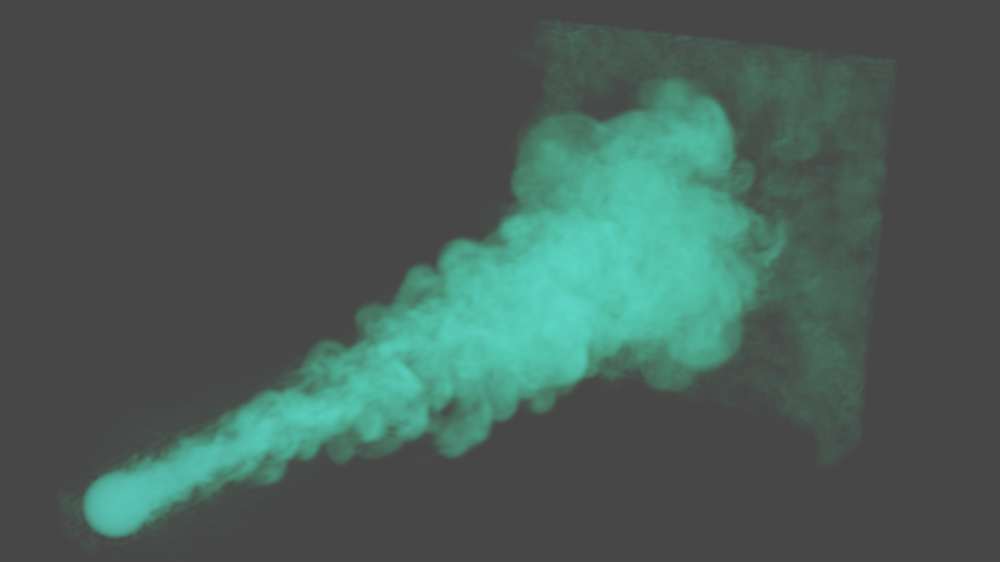
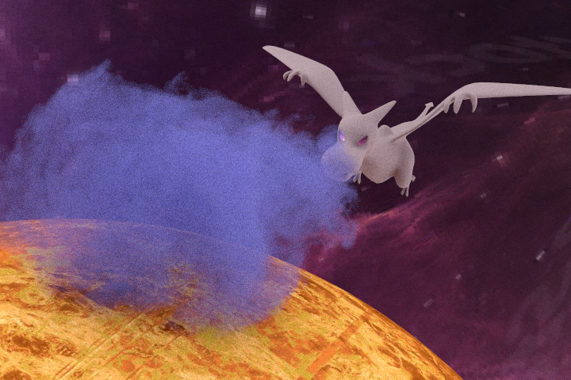
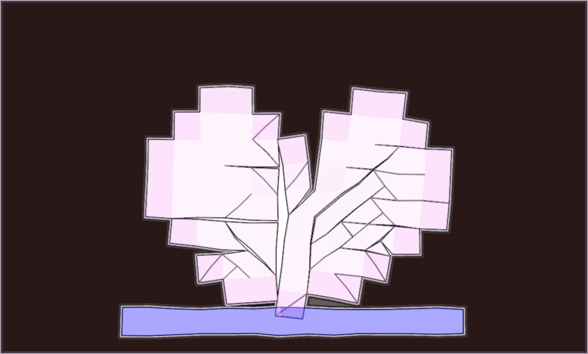

<!-- Write your biography here. Tell the world about yourself. Link to your favorite [subreddit](http://reddit.com). You can put a picture in, too. The code is already in, just name your picture `prof_pic.jpg` and put it in the `img/` folder.

Put your address / P.O. box / other info right below your picture. You can also disable any these elements by editing `profile` property of the YAML header of your `_pages/about.md`. Edit `_bibliography/papers.bib` and Jekyll will render your [publications page](/al-folio/publications/) automatically.

Link to your social media connections, too. This theme is set up to use [Font Awesome icons](http://fortawesome.github.io/Font-Awesome/) and [Academicons](https://jpswalsh.github.io/academicons/), like the ones below. Add your Facebook, Twitter, LinkedIn, Google Scholar, or just disable all of them.
 -->

<!--  -->
I am currently a Master student at Dartmouth College, majoring in Computer Science with concentration in Digital Arts, advised by Professor Bo Zhu in Visual Computing Lab.

Before coming to Dartmouth, I received my Bachelor of Science with Joint Honors in Mathematics and Computer Science from McGill University. It is my fortune to work with Professor Paul Kry and Professor Jean-Christophe Nave on numerical method for physically-based simulation during my undergraduate studies.

My research interests lie in computer graphics, especially on physically-based animation, around which I would like to explore more topics on computational physics, visual scene understanding and machine learning.<a nonsmooth="1" href="../assets/pdf/cv20230913.pdf" class="">[CV]</a> 

---
 
## **Publications**

  

    

      <!--  -->
      

        <b>[Keywords: Modeling and Simulation, Implicit Neural Representation]</b> 
        <i>ACM Transactions on Graphics (SIGGRAPH ASIA 2023)</i> 
        One Paper Accepted! More information will be coming soon.
        <!-- <a nonsmooth="1" href="../assets/pdf/fftfire_midreport.pdf" class="">[Midterm_Report]</a>  -->
      

    

  

---
 
## **Projects**

  

    

      
      

        <b>A Fourier-Spectral Method For Fire and Smoke Simulation</b> 
        <i>Undergraduate Honors Research Project, advised by Prof. Jean-Christophe Nave</i> 
        Implement numerical method for fire and smoke simulation based on Fourier spectral approximations of the Navier-Stokes equations, with volume penalization approach to add obstacles and flame sources.
        <a nonsmooth="1" href="../assets/pdf/fftfire_midreport.pdf" class="">[Midterm_Report]</a> 
      

    

     
    

      
      

        <b>A Review of Second Order Advection-Reflection Fluid Solver</b> 
        <i>Undergraduate Honors Research Project, advised by Prof. Paul Kry</i> 
        Replicate the simulation result using advection-reflection method, and proceed to evaluate and compare the level of detail-preservation by implementing other classical fluid solvers previously employed.
        <a nonsmooth="1" href="../assets/img/reflection_video.webm" class="">[Video]</a> 
      

    

  

---
 
## **Selected Coursework**

  

    

      
      

        <b>A Monte-Carlo Ray Tracer</b> 
        <i>CS287 Rendering Algorithm, Dartmouth College</i> 
        A monte-carlo ray tracer which supports features including: volumetric path tracing, photon mapping, microfacet anisotropic BRDF, environment map with importance sampling, etc.
        <a nonsmooth="1" href="../assets/pdf/cs87/reports/final_project/report.html" class="">[Final_Report]</a> 
      

    

     
    

      
      

        <b>Collections of Mini Physically-Based Animations</b> 
        <i>Comp557/559 Computer Graphics/Animation, McGill University</i> 
        Mini projects on computer graphics and physically-based animation including: collision system, finite-element fracture simulation, geodesics in heat, depth-of-field camera, glsl rigid-body transformations, etc.
        <a nonsmooth="1" href="../assets/img/557demo.webm" class="">[Video]</a> 
      

    

  

