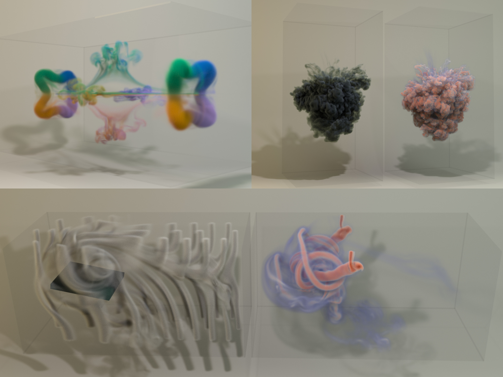

<!-- Write your biography here. Tell the world about yourself. Link to your favorite [subreddit](http://reddit.com). You can put a picture in, too. The code is already in, just name your picture `prof_pic.jpg` and put it in the `img/` folder.

Put your address / P.O. box / other info right below your picture. You can also disable any these elements by editing `profile` property of the YAML header of your `_pages/about.md`. Edit `_bibliography/papers.bib` and Jekyll will render your [publications page](/al-folio/publications/) automatically.

Link to your social media connections, too. This theme is set up to use [Font Awesome icons](http://fortawesome.github.io/Font-Awesome/) and [Academicons](https://jpswalsh.github.io/academicons/), like the ones below. Add your Facebook, Twitter, LinkedIn, Google Scholar, or just disable all of them.
 -->

<!--  -->
I am currently a Master student at Dartmouth College, majoring in Computer Science with concentration in Digital Arts, advised by Professor <a nonsmooth="1" href="https://faculty.cc.gatech.edu/~bozhu/" class="">Bo Zhu</a>.

Before coming to Dartmouth, I received my Bachelor of Science with First-Class Honors in Mathematics and Computer Science from McGill University. It was my fortune to work with Professor <a nonsmooth="1" href="https://www.cs.mcgill.ca/~kry/" class="">Paul Kry</a> and Professor <a nonsmooth="1" href="https://www.math.mcgill.ca/jcnave/" class="">Jean-Christophe Nave</a> on numerical methods for physics-based fluid simulation during my undergraduate studies.

My research interests lie in computer graphics, where I am eager to integrate learning and neural technologies to explore more topics, particularly around physics-based animation, visual scene understanding, and computational design.<a nonsmooth="1" href="../assets/pdf/cv20241120.pdf" class="">[CV]</a> 

---
 
## **Publications**

  

    

      
      

        <b>Fluid Simulation on Neural Flow Maps</b> 
        <i>ACM Transactions on Graphics (SIGGRAPH Asia 2023)</i> 
        <b> <svg xmlns="http://www.w3.org/2000/svg" height="16" width="12" viewBox="0 0 384 512"><!--!Font Awesome Free 6.5.1 by @fontawesome - https://fontawesome.com License - https://fontawesome.com/license/free Copyright 2023 Fonticons, Inc.--><path fill="#ff7f50" d="M173.8 5.5c11-7.3 25.4-7.3 36.4 0L228 17.2c6 3.9 13 5.8 20.1 5.4l21.3-1.3c13.2-.8 25.6 6.4 31.5 18.2l9.6 19.1c3.2 6.4 8.4 11.5 14.7 14.7L344.5 83c11.8 5.9 19 18.3 18.2 31.5l-1.3 21.3c-.4 7.1 1.5 14.2 5.4 20.1l11.8 17.8c7.3 11 7.3 25.4 0 36.4L366.8 228c-3.9 6-5.8 13-5.4 20.1l1.3 21.3c.8 13.2-6.4 25.6-18.2 31.5l-19.1 9.6c-6.4 3.2-11.5 8.4-14.7 14.7L301 344.5c-5.9 11.8-18.3 19-31.5 18.2l-21.3-1.3c-7.1-.4-14.2 1.5-20.1 5.4l-17.8 11.8c-11 7.3-25.4 7.3-36.4 0L156 366.8c-6-3.9-13-5.8-20.1-5.4l-21.3 1.3c-13.2 .8-25.6-6.4-31.5-18.2l-9.6-19.1c-3.2-6.4-8.4-11.5-14.7-14.7L39.5 301c-11.8-5.9-19-18.3-18.2-31.5l1.3-21.3c.4-7.1-1.5-14.2-5.4-20.1L5.5 210.2c-7.3-11-7.3-25.4 0-36.4L17.2 156c3.9-6 5.8-13 5.4-20.1l-1.3-21.3c-.8-13.2 6.4-25.6 18.2-31.5l19.1-9.6C65 70.2 70.2 65 73.4 58.6L83 39.5c5.9-11.8 18.3-19 31.5-18.2l21.3 1.3c7.1 .4 14.2-1.5 20.1-5.4L173.8 5.5zM272 192a80 80 0 1 0 -160 0 80 80 0 1 0 160 0zM1.3 441.8L44.4 339.3c.2 .1 .3 .2 .4 .4l9.6 19.1c11.7 23.2 36 37.3 62 35.8l21.3-1.3c.2 0 .5 0 .7 .2l17.8 11.8c5.1 3.3 10.5 5.9 16.1 7.7l-37.6 89.3c-2.3 5.5-7.4 9.2-13.3 9.7s-11.6-2.2-14.8-7.2L74.4 455.5l-56.1 8.3c-5.7 .8-11.4-1.5-15-6s-4.3-10.7-2.1-16zm248 60.4L211.7 413c5.6-1.8 11-4.3 16.1-7.7l17.8-11.8c.2-.1 .4-.2 .7-.2l21.3 1.3c26 1.5 50.3-12.6 62-35.8l9.6-19.1c.1-.2 .2-.3 .4-.4l43.2 102.5c2.2 5.3 1.4 11.4-2.1 16s-9.3 6.9-15 6l-56.1-8.3-32.2 49.2c-3.2 5-8.9 7.7-14.8 7.2s-11-4.3-13.3-9.7z"/></svg> &nbsp;Best Paper Award </b>  
        Yitong Deng, Hong-Xing Yu, <b>Diyang Zhang</b>, Jiajun Wu, and Bo Zhu 
        <a nonsmooth="1" href="../assets/pdf/NFM.pdf" class="">[Paper]</a>
        <a nonsmooth="1" href="https://youtu.be/zNtPw1zr5tM" class="">[Video]</a>
        <a nonsmooth="1" href="https://yitongdeng-projects.github.io/neural_flow_maps_webpage" class="">[Project Page]</a> 
         
         
      

    

  

---
 
## **GameDev Concepts**

  

    

      
      

        <b>TurboForge</b> 
        <i>An Immersive Car Crafting Simulator in AR/VR</i> 
        With Xinyue Liang and Hongxiao Zheng 
        Made with Unity3D URP&thinsp;&times;&nbsp;Meta XR SDK&thinsp;&times;&nbsp;XR Interaction Toolkit 
        <a nonsmooth="1" href="https://serev99.github.io/turboforge_webpage/" class="">[Project Page]</a> 
         
      

    

     
    

      
      

        <b>Walk Your Cat!</b> 
        <i>A Mixed Reality Concept with Laser Pointer and a Cute Cat</i> 
        With Nate Gordon (Designer) 
        Made with Unity3D URP&thinsp;&times;&nbsp;XR Interaction Toolkit 
        <a nonsmooth="1" href="https://serev99.github.io/walkyourcat_webpage/" class="">[Project Page]</a> 
         
      

    

     
    

      
      

        <b>Octosquishy</b> 
        <i>A Unity3D Side-Scrolling TPS Game Project</i> 
        Independent Work 
        Made with Unity3D URP 
        <a nonsmooth="1" href="https://serev99.github.io/octosquishy_webpage/" class="">[Project Page]</a> 
         
      

    

  

