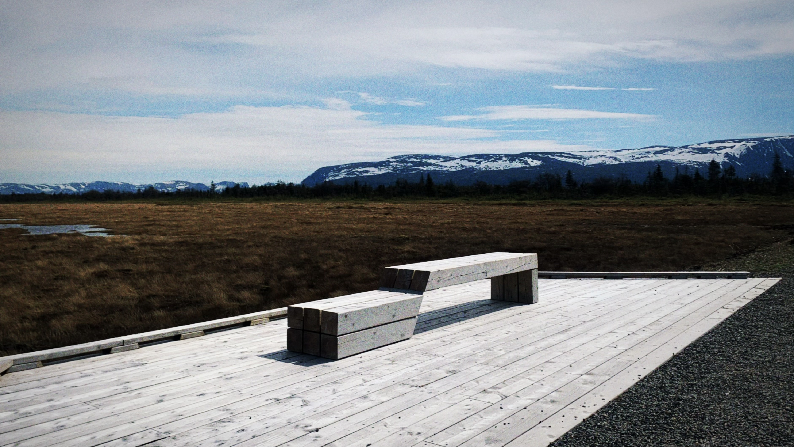

  

    

      
      

        <b>Pokemon Fantasy Room Concept</b> 
        <i>Modeled, textured, rendered from scratch in Maya.</i> 
      

    

     
    

      
      

        <b>YoRHa No.2 Type-B Fan-Art </b> 
        <i>Modeled, rigged, animated from scratch in Maya.</i> 
      

    

     
    

      
      

        <b>Aurora & Van</b> 
        <i>Photography captured by me, March 4th, 2019. Yellowknife, Canada.</i> 
      

    

     
    

      
      

        <b>Lonely Bench</b> 
        <i>Photography captured by me, May 21th, 2022. Rocky Harbour, Newfoundland, Canada.</i> 
      

    

  

