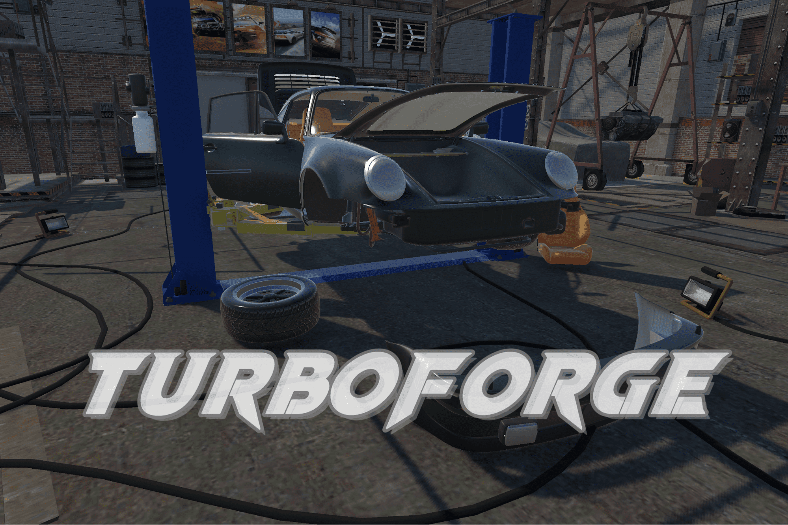

  

    

      
      

         
        <h4><b>TurboForge</b></h4>
        <a nonsmooth="1" href="https://serev99.github.io/turboforge_webpage/" class="">[Project Page]</a>
        <a nonsmooth="1" href="https://youtu.be/4ZVMflLrFMw" class="">[Video]</a> 
        Made with <svg xmlns="http://www.w3.org/2000/svg" height="12" width="12" viewBox="0 0 448 512"><!--!Font Awesome Free 6.5.1 by @fontawesome - https://fontawesome.com License - https://fontawesome.com/license/free Copyright 2024 Fonticons, Inc.--><path d="M243.6 91.6L323.7 138.4C326.6 140 326.7 144.6 323.7 146.2L228.5 201.9C225.6 203.6 222.2 203.4 219.5 201.9L124.4 146.2C121.4 144.6 121.4 140 124.4 138.4L204.4 91.6V0L0 119.4V358.3L78.4 312.5V218.9C78.3 215.6 82.2 213.2 85.1 215L180.3 270.6C183.2 272.3 184.8 275.3 184.8 278.5V389.7C184.8 393 181 395.4 178.1 393.6L98 346.8L19.6 392.6L224 512L428.4 392.6L350 346.8L269.9 393.6C267.1 395.3 263.1 393.1 263.2 389.7V278.5C263.2 275.1 265.1 272.2 267.7 270.6L362.9 215C365.7 213.2 369.7 215.5 369.6 218.9V312.5L448 358.3V119.4L243.6 0V91.6z"/></svg>&thinsp;Unity3D URP&thinsp;&times;&nbsp;<svg xmlns="http://www.w3.org/2000/svg" height="13" width="13" viewBox="0 0 640 512"><!--!Font Awesome Free 6.5.1 by @fontawesome - https://fontawesome.com License - https://fontawesome.com/license/free Copyright 2024 Fonticons, Inc.--><path d="M640 317.9C640 409.2 600.6 466.4 529.7 466.4C467.1 466.4 433.9 431.8 372.8 329.8L341.4 277.2C333.1 264.7 326.9 253 320.2 242.2C300.1 276 273.1 325.2 273.1 325.2C206.1 441.8 168.5 466.4 116.2 466.4C43.4 466.4 0 409.1 0 320.5C0 177.5 79.8 42.4 183.9 42.4C234.1 42.4 277.7 67.1 328.7 131.9C365.8 81.8 406.8 42.4 459.3 42.4C558.4 42.4 640 168.1 640 317.9H640zM287.4 192.2C244.5 130.1 216.5 111.7 183 111.7C121.1 111.7 69.2 217.8 69.2 321.7C69.2 370.2 87.7 397.4 118.8 397.4C149 397.4 167.8 378.4 222 293.6C222 293.6 246.7 254.5 287.4 192.2V192.2zM531.2 397.4C563.4 397.4 578.1 369.9 578.1 322.5C578.1 198.3 523.8 97.1 454.9 97.1C421.7 97.1 393.8 123 360 175.1C369.4 188.9 379.1 204.1 389.3 220.5L426.8 282.9C485.5 377 500.3 397.4 531.2 397.4L531.2 397.4z"/></svg>&thinsp;Meta XR SDK&thinsp;&times;&nbsp;<svg xmlns="http://www.w3.org/2000/svg" height="13" width="13" viewBox="0 0 640 512"><!--!Font Awesome Free 6.5.1 by @fontawesome - https://fontawesome.com License - https://fontawesome.com/license/free Copyright 2024 Fonticons, Inc.--><path d="M576 64H64C28.7 64 0 92.7 0 128V384c0 35.3 28.7 64 64 64H184.4c24.2 0 46.4-13.7 57.2-35.4l32-64c8.8-17.5 26.7-28.6 46.3-28.6s37.5 11.1 46.3 28.6l32 64c10.8 21.7 33 35.4 57.2 35.4H576c35.3 0 64-28.7 64-64V128c0-35.3-28.7-64-64-64zM96 240a64 64 0 1 1 128 0A64 64 0 1 1 96 240zm384-64a64 64 0 1 1 0 128 64 64 0 1 1 0-128z"/></svg>&thinsp;XR Interaction Toolkit 
        <i><u>Concepts:</u></i> Introducing <em>TurboForge: Porsche 930 VR Edition</em> – a MR car crafting simulator where players build their dream sports car, the iconic Porsche 930 Turbo. With realistic workshop environments and intuitive VR controls, assemble and customize every detail, from the engine to the exterior. Install the seats, engines, bumpers and wheels to make your car classic. Then, hit the virtual racetracks to visualize your builds in the showroom. Get ready to experience the thrill of assembling the ultimate sports car in <em>TurboForge</em> !
      

    

     
      
    

      
      

         
        <h4><b>Walk Your Cat!</b></h4>
        <a nonsmooth="1" href="https://serev99.github.io/walkyourcat_webpage/" class="">[Project Page]</a>
        <a nonsmooth="1" href="https://youtu.be/NR0X4dFDPR8" class="">[Video]</a> 
        Made with <svg xmlns="http://www.w3.org/2000/svg" height="12" width="12" viewBox="0 0 448 512"><!--!Font Awesome Free 6.5.1 by @fontawesome - https://fontawesome.com License - https://fontawesome.com/license/free Copyright 2024 Fonticons, Inc.--><path d="M243.6 91.6L323.7 138.4C326.6 140 326.7 144.6 323.7 146.2L228.5 201.9C225.6 203.6 222.2 203.4 219.5 201.9L124.4 146.2C121.4 144.6 121.4 140 124.4 138.4L204.4 91.6V0L0 119.4V358.3L78.4 312.5V218.9C78.3 215.6 82.2 213.2 85.1 215L180.3 270.6C183.2 272.3 184.8 275.3 184.8 278.5V389.7C184.8 393 181 395.4 178.1 393.6L98 346.8L19.6 392.6L224 512L428.4 392.6L350 346.8L269.9 393.6C267.1 395.3 263.1 393.1 263.2 389.7V278.5C263.2 275.1 265.1 272.2 267.7 270.6L362.9 215C365.7 213.2 369.7 215.5 369.6 218.9V312.5L448 358.3V119.4L243.6 0V91.6z"/></svg>&thinsp;Unity3D URP&thinsp;&times;&nbsp;<svg xmlns="http://www.w3.org/2000/svg" height="13" width="13" viewBox="0 0 640 512"><!--!Font Awesome Free 6.5.1 by @fontawesome - https://fontawesome.com License - https://fontawesome.com/license/free Copyright 2024 Fonticons, Inc.--><path d="M576 64H64C28.7 64 0 92.7 0 128V384c0 35.3 28.7 64 64 64H184.4c24.2 0 46.4-13.7 57.2-35.4l32-64c8.8-17.5 26.7-28.6 46.3-28.6s37.5 11.1 46.3 28.6l32 64c10.8 21.7 33 35.4 57.2 35.4H576c35.3 0 64-28.7 64-64V128c0-35.3-28.7-64-64-64zM96 240a64 64 0 1 1 128 0A64 64 0 1 1 96 240zm384-64a64 64 0 1 1 0 128 64 64 0 1 1 0-128z"/></svg>&thinsp;XR Interaction Toolkit 
        <i><u>Concepts:</u></i> Welcome to the world "Walk Your Cat"! In this technologically advanced era, you'll embark on an exciting journey with your adorable virtual feline companion. But beware, even though your furry friend may be fictional, the fun is very real! 
        Why not try out the latest in cat play technology? Grab your laser pointer and guide your virtual cat through a myriad of delightful challenges, both in the real world and the digital realm. Are you ready to unleash your imagination and embark on an infinite fantasy journey? Let the games begin!
      

    

     
      
    

      
      

         
        <h4><b>Octosquishy</b></h4>
        <a nonsmooth="1" href="https://serev99.github.io/octosquishy_webpage/" class="">[Project Page]</a>
        <a nonsmooth="1" href="https://youtu.be/pe9Ufn9bB5M" class="">[Video]</a> 
        Made with <svg xmlns="http://www.w3.org/2000/svg" height="12" width="12" viewBox="0 0 448 512"><!--!Font Awesome Free 6.5.1 by @fontawesome - https://fontawesome.com License - https://fontawesome.com/license/free Copyright 2024 Fonticons, Inc.--><path d="M243.6 91.6L323.7 138.4C326.6 140 326.7 144.6 323.7 146.2L228.5 201.9C225.6 203.6 222.2 203.4 219.5 201.9L124.4 146.2C121.4 144.6 121.4 140 124.4 138.4L204.4 91.6V0L0 119.4V358.3L78.4 312.5V218.9C78.3 215.6 82.2 213.2 85.1 215L180.3 270.6C183.2 272.3 184.8 275.3 184.8 278.5V389.7C184.8 393 181 395.4 178.1 393.6L98 346.8L19.6 392.6L224 512L428.4 392.6L350 346.8L269.9 393.6C267.1 395.3 263.1 393.1 263.2 389.7V278.5C263.2 275.1 265.1 272.2 267.7 270.6L362.9 215C365.7 213.2 369.7 215.5 369.6 218.9V312.5L448 358.3V119.4L243.6 0V91.6z"/></svg>&thinsp;Unity3D URP 
        <i><u>Concepts:</u></i> In the vibrant underwater world of Aqua Haven, lived our cute octopus, Octosquishy. Known for his friendly nature and love for exploration, Octosquishy stumbled upon a mysterious ancient inkwell one sunny day. This enchanted inkwell granted him the power to turn ordinary squids into playful, water-blasting sidekicks. As the news of his newfound abilities spread, a mischievous group of evil sharks began wreaking havoc, threatening the harmony of Aqua Haven. With his loyal squad of squid buddies, Octosquishy sets out on a heartwarming adventure to restore peace to the ocean depths.
      

    

     
  

